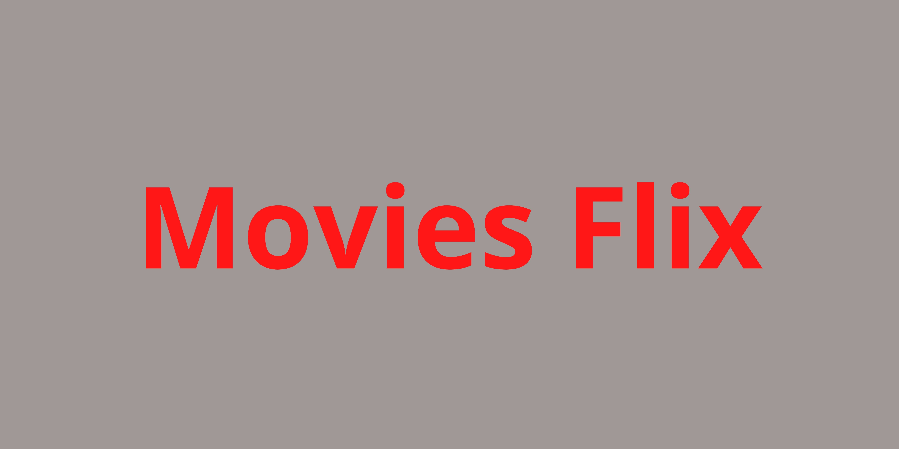

  

<h1 align="center">Movies Flix</h1>

Application that simulates a streaming service for movies. The main objective in this project was apply CRUD conceptions. Was used a mock api to get the movies. Designed in responsive mode.

## Demo

Desktop demo:

    

Mobile demo: 

  

 

## Used Technologies

* REACT.JS
* REACT-BOOTSTRAP
* REDUX
* JSON-SERVER
* CSS

## Features

* Can get information about movies
* Can create, read, update and delete movies
* Designed in responsive mode

## To Run Locally

Clone the project

`git clone https://github.com/andrearnoni/movies-crud.git`

Go to the project directory

`cd movies-crud`

### 1 - In the mock-api folder

Install dependencies

`npm install`

Start the server

`npm start`

The server will running on: `localhost:3001/movies`

### 2 - In the movies-crud folder

Install dependencies

`npm install`

Start the server

`npm start`

## Author

This project was coded and designed by [@andrearnoni](https://github.com/andrearnoni).

### Go to my [Portfolio!](https://andrearnoni.vercel.app/) 
### Connect with me at [LinkedIn!](https://www.linkedin.com/in/andrearnoni/) 